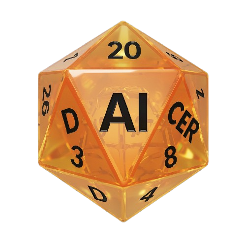
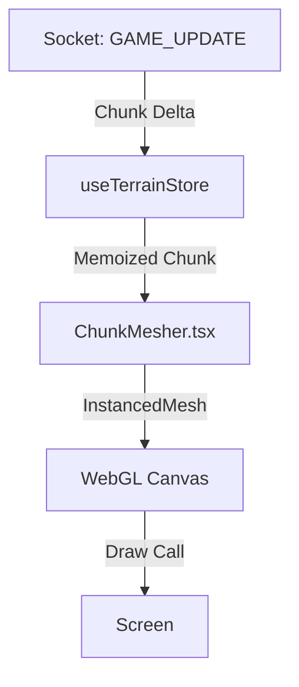

<div align="center">



# Daicer Frontend

**The Face of the Simulation.**

[](https://github.com/lguibr/daice/actions/workflows/frontend.yml)
[](https://codecov.io/gh/lguibr/daice)
[](https://react.dev/)
[](https://threejs.org/)
[](https://vitejs.dev/)

> **"A Cinematic Interface for an Infinite World."**

</div>

---

## 🎨 The "Juicy Layout" Philosophy

Daicer is not a dashboard. It is an immersive experience.
We enforce a strict design language that prioritizes **Atmosphere** over utility.

- **Dark Mode Only:** The UI must blend into the Void.
- **Motion Design:** Nothing snaps. Everything flows.
- **Glassmorphism:** HUD elements float above the 3D world, blurring the line between interface and game.
- **Diegetic UI:** Health bars and status effects exist _inside_ the world space.

---

## 🛣 The Data Flow

How does the Frontend know what to render?

### 1. Codegen (The Type Safety Net)

We do not manually type payload responses.
The frontend uses `@graphql-codegen/cli` to scan the running Backend (`:1337/graphql`) and generate:

- **Operations:** Typed hooks (`useGetRoomQuery`).
- **Contracts:** Interfaces matching the Strapi Schema.

```bash
# Regenerate Types (Requires Backend Running)
yarn active-codegen
```

### 2. The Rendering Loop

The `MapRenderer` (`src/three/MapRenderer.tsx`) is the heart of the visualization.



- **Step 1: Delta Compression.** The server sends only _changed_ voxels, not the whole world.
- **Step 2: Optimistic Update.** The Store updates immediately.
- **Step 3: Instancing.** We use `three-stdlib` and `InstancedMesh` to render 100k voxels with <10 draw calls.

---

## 🧠 State Management (`Zustand`)

We do not use Redux. We use **Zustand** + **Socket.IO**.

The Frontend is a "Thin Client". It does not calculate physics. It only _visualizes_ the state sent by the Server.

**Optimistic Updates:**
When a user moves, we _immediately_ update the visual state (Optimistic UI). If the server rejects the move (Collision), we "rubber band" the token back to its valid position.

---

## 🗺 Documentation Map

> **Click headers to dive deep.**

| Module                                                           | Description                                           | Key Tech                   |
| :--------------------------------------------------------------- | :---------------------------------------------------- | :------------------------- |
| **[🧱 Components (`src/components`)](src/components/README.md)** | The "Juicy" UI Library. Atomic Design + Game Widgets. | `Atomic Design`, `HUD`     |
| **[🧠 Stores (`src/stores`)](src/stores/README.md)**             | Client-side State Management.                         | `Zustand`, `Immer`         |
| **[⚓️ Hooks (`src/hooks`)](src/hooks/README.md)**                | Reusable React Logic & Socket Listeners.              | `useSocket`, `useKeyboard` |
| **[⚡️ Features (`src/features`)](src/features/README.md)**       | Complex domains like Debug Tools and Room Creation.   | `MapRenderer3D`, `Lobby`   |

---

## 🛠 Local Development

```bash
# Start the Cinematic Experience
yarn workspace @daicer/frontend dev
```

### Key Commands

| Command          | Description                                                               |
| :--------------- | :------------------------------------------------------------------------ |
| `yarn storybook` | **Visual Lab.** Develop UI components in isolation to perfect animations. |
| `yarn test:ui`   | **Playwright Mode.** Watch the E2E tests run like a movie.                |
| `yarn qa`        | **Quality Gate.** Runs Lint, Typecheck, and Unit Tests.                   |

---

## 🧪 Testing Strategy

1.  **Unit Tests (Vitest):** Validate logic hooks and isolated components.
2.  **Visual Regression (Storybook):** Ensure the "Epic Aesthetic" doesn't degrade.
3.  **End-to-End (Playwright):** Simulate a full user session from Login to Combat.

---

<div align="center">

**[View Backend Documentation](../backend/README.md) • [Contribution Guide](../CONTRIBUTING.md)**

</div>
