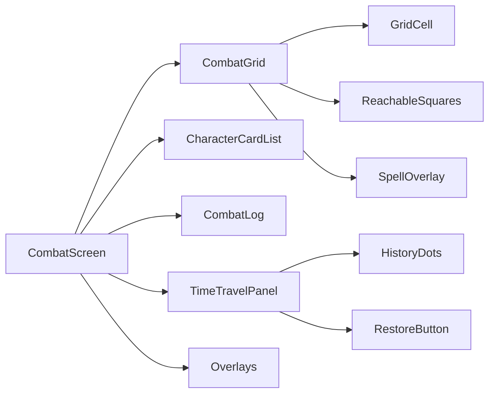
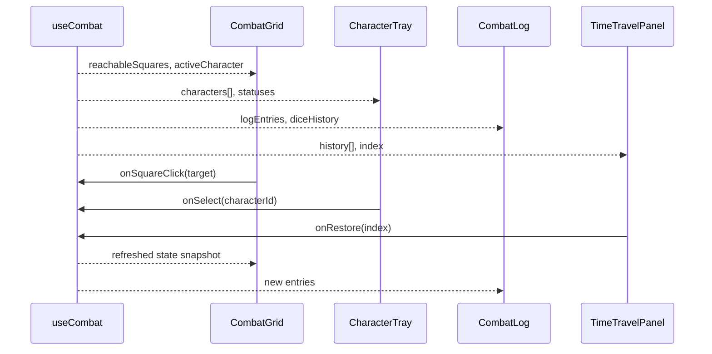

# Combat Components

React components that render tactical encounters, visualize dice-driven outcomes, and enable combat time-travel.

---

## Module Overview



- `CombatScreen.tsx` orchestrates layout, data fetching (via `useCombat`), and event wiring.
- Components consume shared types from `@/types/combat` and selectors exposed by the `useCombat` hook.
- Visual state derives from deterministic combat snapshots produced by the backend.

---

## Component Matrix

| Component              | Responsibility                         | Key Props                                                                        |
| ---------------------- | -------------------------------------- | -------------------------------------------------------------------------------- |
| `CombatGrid`           | Grid rendering, square interaction     | `gridWidth`, `gridHeight`, `characters`, `reachableSquares`, `onSquareClick`     |
| `CharacterCard`        | Display combatant stats and status     | `character`, `isActive`, `isSelected`, `onClick`                                 |
| `CharacterTray`        | Group of `CharacterCard`s with filters | `characters`, `activeCharacterId`, `onSelect`                                    |
| `CombatLog`            | Scrollable log with dice details       | `entries`, `diceHistory`, `onExpand`                                             |
| `TimeTravelPanel`      | Timeline of past turns/states          | `history`, `currentIndex`, `onRestore`, `isOpen`                                 |
| `CombatToolbar`        | Controls (end turn, undo, debug)       | `onEndTurn`, `canUndo`, `onUndo`, `isDm`                                         |
| `SpellEffectOverlay`   | AoE visualizations                     | `gridWidth`, `gridHeight`, `casterPosition`, `targetPosition`, `affectedSquares` |
| `SpellSummaryPanel`    | Active spell overview + loadout status | `spell`, `preview`, `resolution`, `caster`, `loadout`, `activeSpellId`           |
| `CombatCharacterSheet` | Modal sheet for a combatant            | `character`, `onClose`                                                           |

---

## Data Flow



State contract:

- `useCombat` returns immutable snapshots; components operate on read-only data.
- Mutating actions (move, cast spell, restore) route back through the hook, which emits socket events.
- Hook ensures optimistic updates revert if server rejects action (via version numbers).

---

## Styling & Visual Rules

- Grid squares size (px) derived from container width; maintain 1:1 aspect ratio.
- Friendly vs hostile tokens use aurora (cyan) vs ember (orange) palettes.
- Selected squares animate with subtle pulse (`animate-pulse`), but respect `prefers-reduced-motion`.
- Time-travel panel overlays on top-right for desktop; mobile collapses to bottom sheet.

---

## Accessibility

- `CombatGrid` renders using `<button>` elements for squares to guarantee keyboard navigation.
- Arrow keys move focus across grid; hitting `Enter` triggers `onSquareClick`.
- `CombatLog` uses `aria-live="polite"` for fresh narration.
- Timeline dots expose `aria-label` with round/turn info.

---

## Testing

```bash
yarn test frontend/src/components/combat/__tests__
```

- Use Testing Library to simulate keyboard + mouse interactions.
- Mock `useCombat` hook to deliver deterministic snapshots.
- Snapshot tests for overlays ensure geometry accuracy (with seeded fixtures).

---

## Storybook Coverage

```bash
yarn storybook
```

Available stories under `Combat/`:

- Combat grid at multiple sizes with reachable moves.
- Character cards (ally/enemy, active, unconscious).
- Combat log entries with expanded dice history.
- Time travel panel with branching history.

Use stories to validate new visual states before wiring them into live data.

---

## Integration Notes

- Backend emits `combat:timeline` events; `useCombat` merges them into history state.
- Spell overlays consume backend-provided geometry arrays (`affectedSquares`).
- Shared spell loadouts live in `daicer/shared/combat-demo/spellLoadouts.ts`; frontend and backend both consume this map to stay in sync.
- Ensure `CombatScreen` renders `DebugPanel` hooks in dev mode only to avoid leaking secrets in production.

---

## Extending Combat UI

1. Update shared types (`@/types/combat`) if payloads change.
2. Extend `useCombat` to expose new selectors or actions.
3. Add component stories + tests for new scenario.
4. Document behavior here (props, state dependencies).
5. Sync with backend docs (`backend/src/types/README-SPELLS.md`) for geometry alignment.

---

## Smoke Test Checklist

1. Start backend + frontend, then open `http://localhost:3000/combat-demo`.
   - Step through each timeline entry and ensure spell overlay highlights affected squares.
   - Click multiple character cards (players + enemies) and confirm the character sheet modal renders stats and closes.
2. Navigate to `http://localhost:3000/spellbook-demo`.
   - Preview and cast a spell; verify effect colors and geometry match the combat demo overlay.
   - Ensure scenario placement controls still operate (targeting, placing allies/enemies).
