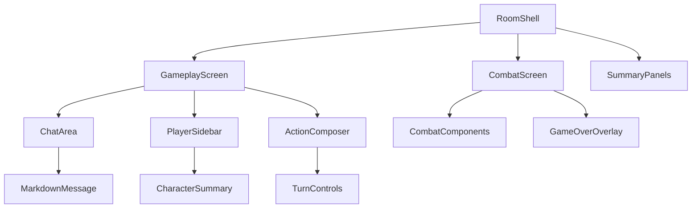
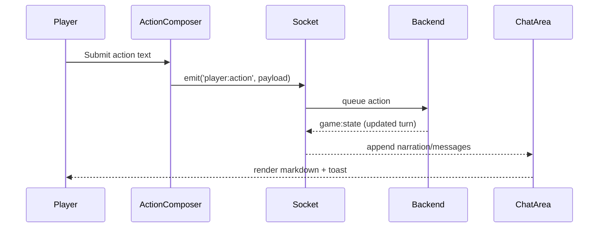
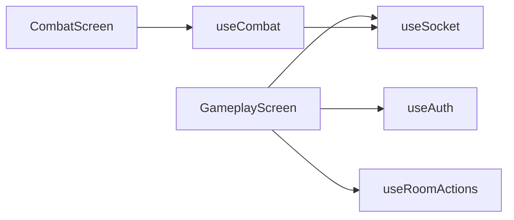

# Game Components

Narrative gameplay surface, player coordination tools, and combat hand-off orchestrated inside `components/game`.

---

## Overview



- `RoomShell.tsx` chooses between `GameplayScreen` and `CombatScreen` based on socket state (`room.phase`).
- Gameplay components render DM narration, player chat, and action submission.
- Combat components are described in detail in `components/combat/README.md`.

---

## Screens

### `GameplayScreen`

| Responsibility        | Details                                           |
| --------------------- | ------------------------------------------------- |
| Render narrative loop | Chat stream (DM + players) + action composer      |
| Track readiness       | Shows who has submitted actions, DM-only controls |
| Handle transitions    | Displays countdown when combat is initiated       |

Props:

```typescript
interface GameplayScreenProps {
  room: RoomState;
  messages: Message[];
  activePlayers: PlayerSummary[];
  onSubmitAction: (payload: SubmitActionInput) => Promise<void>;
  onProcessTurn: () => Promise<void>;
  isDm: boolean;
}
```

### `CombatScreen`

Wraps combat components and exposes debug hooks in dev:

- Displays overlays for victory/defeat or retreat.
- Provides DM-only controls (`End Turn`, `Rewind`, `Spawn Creature`).
- Integrates with `useCombat` for socket-driven updates.

---

## Supporting Components

| Component         | Role                                                 | Notes                                                    |
| ----------------- | ---------------------------------------------------- | -------------------------------------------------------- |
| `ChatArea`        | Stream of DM + player messages with markdown support | `aria-live="polite"`, auto-scroll with anchor locking    |
| `PlayerSidebar`   | Party roster, readiness indicators, creature list    | Sorts by initiative when in combat                       |
| `ActionComposer`  | Textarea + quick actions + submit button             | Disables on combat turns, persists draft in localStorage |
| `MarkdownMessage` | Sanitized markdown renderer for DM narration         | Uses `remark-gfm`, custom dark theme                     |
| `ActionStatusBar` | Shows how many actions are pending and turn owner    | DM sees next-step CTA                                    |
| `GameOverOverlay` | End-of-session summary                               | Triggered when backend signals game complete             |

All components use strict props typed in `@/types/game`.

---

## Data & Message Flow



- `useSocket` hook streams socket events into Zustand store (`useRoomStore`).
- `ChatArea` listens to store selectors (`selectMessages`, `selectWorldDescription`).
- `GameplayScreen` triggers `onProcessTurn` for DM; backend response rehydrates entire turn state and resets composer.

---

## Hooks Integration



- `useRoomActions` exposes `submitAction`, `processTurn`, `leaveRoom`.
- `useSocket` handles reconnection: on reconnect, fetches latest REST snapshot to avoid stale UI.
- `useAuth` injects player metadata for message attribution.

---

## Accessibility

- `ChatArea` uses semantic `<article>` per message; DM narration flagged with `role="status"`.
- Action composer has label + helper text (character count, hints).
- Player sidebar uses `<ol>` to convey initiative order.
- Keyboard shortcuts:
  - `Ctrl+Enter` submits action.
  - `Ctrl+D` toggles debug panel (dev only).

---

## Testing Strategy

```bash
yarn test frontend/src/components/game/__tests__
```

- Mock socket store to simulate DM/user states.
- Validate markdown sanitization (no raw HTML injection).
- Confirm action composer disables during combat or when DM processes turn.
- Snapshot game over overlay to catch styling regressions.

---

## Storybook Coverage

Stories live under `Game/`:

- `GameplayScreen/Default` — balanced party, awaiting actions.
- `GameplayScreen/DMReady` — DM ready to process turn.
- `ChatArea/Markdown` — DM narration with tables, lists, images.
- `PlayerSidebar/Combat` — initiative ordering and condition badges.
- `GameOverOverlay/Defeat` — failure state.

Run:

```bash
yarn storybook
```

---

## Extending Gameplay Layer

1. Add new message types to `@/types/messages` and map to ChatArea renderer.
2. Update `useRoomStore` selectors if additional derived data required.
3. Expand Action Composer with structured inputs (e.g. quick macros).
4. Mirror changes in backend docs (`backend/src/socket/README.md`) for new events.
5. Document prop updates here and refresh Storybook stories.
